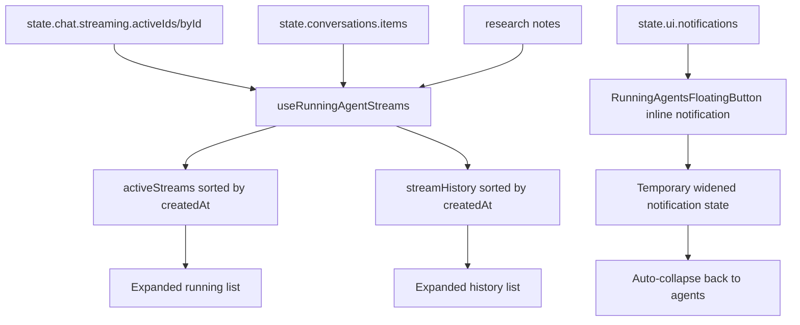

---
paths:
  - "client/ygg-chat-r/src/components/RunningAgentsFloatingButton/**"
  - "client/ygg-chat-r/src/hooks/useRunningAgentStreams.ts"
  - "client/ygg-chat-r/src/components/GlobalNotifications/**"
  - "client/ygg-chat-r/src/features/ui/uiSlice.ts"
  - "client/ygg-chat-r/src/App.tsx"
---

# Agent Context: Floating Agent Button Design

Last reviewed: 2026-06-17

## Purpose

Documents the current floating agent/app button interaction pattern so future UI surfaces can reuse the same polished expansion/collapse feel without rediscovering the animation details.

Open this file when changing or borrowing the animation/style from:

- `client/ygg-chat-r/src/components/RunningAgentsFloatingButton/RunningAgentsFloatingButton.tsx`
- app-shell floating controls in `client/ygg-chat-r/src/App.tsx`
- any future compact-to-expanded pill, popover launcher, or inline notification surface.

## Key Files

- `client/ygg-chat-r/src/components/RunningAgentsFloatingButton/RunningAgentsFloatingButton.tsx` - canonical implementation of the style and animation.
- `client/ygg-chat-r/src/hooks/useRunningAgentStreams.ts` - stream view-model derivation for active/history agent rows.
- `client/ygg-chat-r/src/App.tsx` - mounts the floating button from `HtmlToolsShell` and wires the apps modal action.
- `client/ygg-chat-r/src/components/GlobalNotifications/GlobalNotifications.tsx` - keeps notification lifecycle/timers but no longer renders separate toast cards.
- `client/ygg-chat-r/src/features/ui/uiSlice.ts` - notification state shape used by inline stream-completion notifications.

## UX Intent

The floating agent button is a compact, fluid app-shell control. It should feel like one continuous object that changes shape rather than separate UI pieces appearing and disappearing.

Default/collapsed state:

- Shows the text `agents`.
- Shows a small status dot:
  - neutral when idle;
  - emerald when streams are active;
  - rose when an active stream has an error.
- Shows an apps-modal expand button pinned to the far right.
- The main `agents` area expands/collapses the running-agent panel.
- The apps expand button opens/closes the HTML tools/apps modal.

Expanded state:

- The outer shell widens/height-expands using Framer Motion layout animation.
- The apps expand button stays visually pinned to the far right of the widened shell.
- The running-agent panel appears below the top row.
- Active stream list and history list are independently scrollable.
- Active streams and history are sorted by stream start/created time.

Notification state:

- Stream-completion notifications are repurposed into the same floating shell.
- On completion, the inner `agents` content is temporarily replaced by an inline completion notification.
- The shell widens smoothly, displays the notification, then collapses back to the normal `agents` state.
- Clicking the inline notification dismisses it and navigates to the completed stream target.

## Animation Recipe

Use Framer Motion layout animation for the outer shell and content swaps.

Canonical transition constants, from the current implementation:

```ts
const springTransition = {
  type: 'spring' as const,
  stiffness: 340,
  damping: 44,
  mass: 0.86,
}

const collapseTransition = springTransition

const internalTransition = {
  type: 'spring' as const,
  stiffness: 300,
  damping: 40,
  mass: 0.8,
}

const softTransition = { duration: 0.18, ease: 'easeOut' as const }
const collapseSoftTransition = { duration: 0.24, ease: 'easeInOut' as const }
```

Important animation rules:

- Expansion and collapse should use the same spring. Do not make collapse a separate tighter spring unless the design deliberately wants a different close feel.
- Use `layout` on the outer fixed wrapper and inner shell.
- Use `AnimatePresence mode='popLayout'` for content swaps and details panel enter/exit.
- For vertical panel expansion, animate a details shell from `height: 0` to `height: 'auto'`, with `overflow-hidden`.
- For content inside the height shell, use a separate inner motion layer for opacity/y/scale so the height animation remains clean.
- Add `will-change-[width,height,transform]` to the animated shell for smoother browser compositing.
- Avoid mixing CSS `hover:scale-*` with Framer `layout` on the same button. That caused back-and-forth jitter on the apps button. Prefer color-only CSS transitions or Framer-only transforms.
- Keep the apps expand button as a normal `button` rather than a layout `motion.button`; animate only its icon swap.

## Layout Rules

Top row:

- Use a full-width flex row: `flex w-full items-center justify-between`.
- Left/main content is either:
  - compact `agents` control; or
  - inline notification content.
- Right content is always the apps-modal expand button.
- The apps expand button must be `shrink-0` so it stays pinned to the far right as the shell widens.

Shell:

- Fixed-position app-shell control, currently mounted around bottom-right.
- Rounded shell: `rounded-[28px]`.
- Use a translucent background and backdrop blur:
  - light: `bg-white/90`;
  - dark: `dark:bg-yBlack-900/90`.
- Keep border and shadow subtle but present.

Lists:

- Active streams: `max-h-72 overflow-y-auto`.
- History: `max-h-56 overflow-y-auto`.
- Keep rows compact, rounded, and keyboard-clickable.

## Data Flow



## Accessibility and Interaction

- Main compact control should expose `aria-label` based on active stream count, or the notification title when notification content is showing.
- Use buttons for clickable rows and notification content.
- Clicking a stream/history row navigates to `/chat/:projectId/:conversationId#messageId`.
- Clicking inline notification dismisses it and navigates to its target route.
- Respect reduced motion via `useReducedMotion()` and fall back to short opacity/timing transitions.

## Gotchas

- Do not reintroduce a separate visible toast for stream-completion notifications unless product wants duplicate notification surfaces.
- `GlobalNotifications` currently owns notification auto-dismiss lifecycle but returns `null`; keep that if the floating button remains the notification presentation.
- If multiple notification types are added, decide whether they should all appear in the floating button or only `branch_stream_completed`.
- If the apps button becomes a `motion.button` with `layout`, test carefully for jitter. The current stable pattern is normal button shell plus tiny animated icon.
- Stream display labels in the compact top-level control should remain `agents`; individual rows can use `agent-1`, `agent-2`, etc.

## Validation

- Run `npm --prefix client/ygg-chat-r run build:web` after changes.
- Manual checks:
  1. Idle collapsed state shows `agents` and neutral dot.
  2. Active stream state shows emerald dot and count badge if multiple streams exist.
  3. Expanding and collapsing feel like reverse directions of the same motion.
  4. Apps expand button stays pinned far right in both collapsed and expanded/notification states.
  5. Stream-completion notification widens the shell, then returns to `agents` state.
  6. Clicking notification navigates to the completed stream.
  7. Active and history lists scroll and remain sorted by start/created time.
