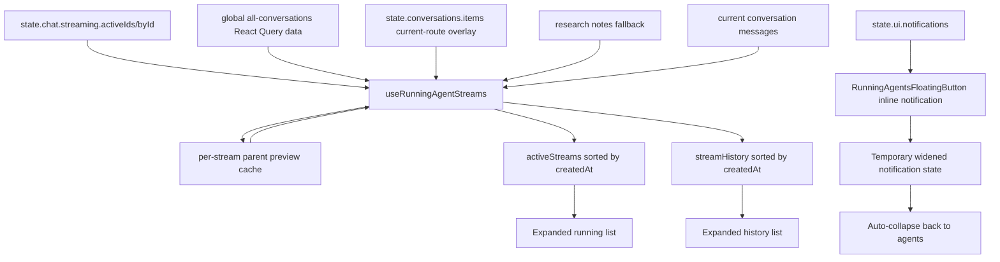

---
paths:
  - "client/ygg-chat-r/src/components/RunningAgentsFloatingButton/**"
  - "client/ygg-chat-r/src/hooks/useRunningAgentStreams.ts"
  - "client/ygg-chat-r/src/components/GlobalNotifications/**"
  - "client/ygg-chat-r/src/features/ui/uiSlice.ts"
  - "client/ygg-chat-r/src/App.tsx"
---

# Agent Context: Floating Agent Button Design

Last reviewed: 2026-06-17

## Purpose

Documents the current floating agent/app button interaction pattern so future UI surfaces can reuse the same polished expansion/collapse feel without rediscovering the animation details.

Open this file when changing or borrowing the animation/style from:

- `client/ygg-chat-r/src/components/RunningAgentsFloatingButton/RunningAgentsFloatingButton.tsx`
- app-shell floating controls in `client/ygg-chat-r/src/App.tsx`
- any future compact-to-expanded pill, popover launcher, or inline notification surface.

## Key Files

- `client/ygg-chat-r/src/components/RunningAgentsFloatingButton/RunningAgentsFloatingButton.tsx` - canonical implementation of the style and animation.
- `client/ygg-chat-r/src/hooks/useRunningAgentStreams.ts` - stream view-model derivation for active/history agent rows.
- `client/ygg-chat-r/src/App.tsx` - mounts the floating button from `HtmlToolsShell` and wires the apps modal action.
- `client/ygg-chat-r/src/components/GlobalNotifications/GlobalNotifications.tsx` - keeps notification lifecycle/timers but no longer renders separate toast cards.
- `client/ygg-chat-r/src/features/ui/uiSlice.ts` - notification state shape used by inline stream-completion notifications.

## UX Intent

The floating agent button is a compact, fluid app-shell control. It should feel like one continuous object that changes shape rather than separate UI pieces appearing and disappearing.

Default/collapsed state:

- Shows the text `agents`.
- Shows a small status dot:
  - neutral when idle;
  - emerald when streams are active;
  - rose when an active stream has an error.
- Shows an apps-modal expand button pinned to the far right.
- The main `agents` area expands/collapses the running-agent panel.
- The apps expand button opens/closes the HTML tools/apps modal.

Expanded state:

- The outer shell widens/height-expands using Framer Motion layout animation.
- The apps expand button stays visually pinned to the far right of the widened shell.
- The running-agent panel appears below the top row.
- Active forks and idle-fork history are independently scrollable, sorted by their latest run's start/created time.
- Group runs by `(conversationId, server-confirmed lineageId)`; retain separate stream IDs for execution and replay. Initial source lineages and missing identities stay as individual unresolved runs until the server resolves them.
- Show one row per fork with a stable shortened lineage label, the latest active request/navigation target, and running/recent counts. Idle rows use the latest completed run.
- Recent completed runs stay under their active fork rather than duplicating it in History. A native disclosure exposes individual runs when more than one is retained.
- Compact/header counts describe active fork groups, while the accessible label also reports running executions. History remains component-local and bounded to 40 completed runs.

Notification state:

- Stream-completion notifications are repurposed into the same floating shell.
- On completion, the inner `agents` content is temporarily replaced by an inline completion notification.
- The shell widens smoothly, displays the notification, then collapses back to the normal `agents` state.
- Clicking the inline notification dismisses it and navigates to the completed stream target.

## Animation Recipe

Use Framer Motion layout animation for the outer shell and content swaps.

Canonical transition constants, from the current implementation:

```ts
const springTransition = {
  type: 'spring' as const,
  stiffness: 340,
  damping: 44,
  mass: 0.86,
}

const collapseTransition = springTransition

const internalTransition = {
  type: 'spring' as const,
  stiffness: 300,
  damping: 40,
  mass: 0.8,
}

const softTransition = { duration: 0.18, ease: 'easeOut' as const }
const collapseSoftTransition = { duration: 0.24, ease: 'easeInOut' as const }
```

Important animation rules:

- Expansion and collapse should use the same spring. Do not make collapse a separate tighter spring unless the design deliberately wants a different close feel.
- Use `layout` on the outer fixed wrapper and inner shell.
- Use `AnimatePresence mode='popLayout'` for content swaps and details panel enter/exit.
- For vertical panel expansion, animate a details shell from `height: 0` to `height: 'auto'`, with `overflow-hidden`.
- For content inside the height shell, use a separate inner motion layer for opacity/y/scale so the height animation remains clean.
- Add `will-change-[width,height,transform]` to the animated shell for smoother browser compositing.
- Avoid mixing CSS `hover:scale-*` with Framer `layout` on the same button. That caused back-and-forth jitter on the apps button. Prefer color-only CSS transitions or Framer-only transforms.
- Keep the apps expand button as a normal `button` rather than a layout `motion.button`; animate only its icon swap.

## Layout Rules

Top row:

- Use a full-width flex row: `flex w-full items-center justify-between`.
- Left/main content is either:
  - compact `agents` control; or
  - inline notification content.
- Right content is always the apps-modal expand button.
- The apps expand button must be `shrink-0` so it stays pinned to the far right as the shell widens.

Shell:

- Fixed-position app-shell control, currently mounted around bottom-right.
- Rounded shell: `rounded-[28px]`.
- Use a translucent background and backdrop blur:
  - light: `bg-white/90`;
  - dark: `dark:bg-yBlack-900/90`.
- Keep border and shadow subtle but present.

Lists:

- Active streams: `max-h-72 overflow-y-auto`.
- History: `max-h-56 overflow-y-auto`.
- Keep rows compact, rounded, and keyboard-clickable.

## Data Flow


```mermaid
flowchart TD
  A[state.chat.streaming.activeIds/byId] --> B[useRunningAgentStreams]
  C[global all-conversations React Query data] --> B
  D[state.conversations.items current-route overlay] --> B
  N[research notes fallback] --> B
  M[current conversation messages] --> B
  P[per-stream parent preview cache] --> B
  B --> P
  B --> E[activeStreams sorted by createdAt]
  B --> F[streamHistory sorted by createdAt]
  G[state.ui.notifications] --> H[RunningAgentsFloatingButton inline notification]
  E --> I[Expanded running list]
  F --> J[Expanded history list]
  H --> K[Temporary widened notification state]
  K --> L[Auto-collapse back to agents]
```

## Accessibility and Interaction

- Main compact control should expose `aria-label` based on active stream count, or the notification title when notification content is showing.
- Use buttons for clickable rows and notification content.
- Clicking a stream/history row opens its read-only run preview inside the floating shell. Open chat explicitly navigates to `/chat/:projectId/:conversationId#messageId`.
- Clicking inline notification dismisses it and navigates to its target route.
- Respect reduced motion via `useReducedMotion()` and fall back to short opacity/timing transitions.

## Gotchas

- Do not reintroduce a separate visible toast for stream-completion notifications unless product wants duplicate notification surfaces.
- `GlobalNotifications` currently owns notification auto-dismiss lifecycle but returns `null`; keep that if the floating button remains the notification presentation.
- If multiple notification types are added, decide whether they should all appear in the floating button or only `branch_stream_completed`.
- If the apps button becomes a `motion.button` with `layout`, test carefully for jitter. The current stable pattern is normal button shell plus tiny animated icon.
- The compact top-level label remains `agents`. Group rows use a shortened durable lineage ID rather than positional `agent-1` / `agent-2` labels, which would change when sorting changes.

## Validation

- Run `npm --prefix client/ygg-chat-r run build:web` after changes.
- Manual checks:
  1. Idle collapsed state shows `agents` and neutral dot.
  2. Active stream state shows emerald dot and count badge if multiple streams exist.
  3. Expanding and collapsing feel like reverse directions of the same motion.
  4. Apps expand button stays pinned far right in both collapsed and expanded/notification states.
  5. Stream-completion notification widens the shell, then returns to `agents` state.
  6. Clicking notification navigates to the completed stream.
  7. Active and history lists scroll and remain sorted by the latest run's start/created time.
  8. Consecutive sends on one fork reuse one group; sibling forks remain separate, including while their server identity resolves.
  9. Expand recent runs and navigate to individual run targets; a fork with multiple active executions counts as one fork.

## In-pill run transcript previews

The selected run expands the shell vertically into a bounded, scrollable transcript with Back, an independent Group steps toggle, and Open chat. Completion notifications do not collapse an open preview. Auto-follow pauses when the user scrolls away from the bottom; Jump to latest resumes it.

`features/chats/agentRunPreviewSlice.ts` is renderer-session Redux state, separate from normal stream slots and Query snapshots. Synchronous middleware captures reduced live tails before subsequent actions can reset a turn. `mainChatClient` captures normalized `messageAdded` projections with their stream ID before the visible-conversation guard, for initial reads and reattach. Complete-chunk capture also supports direct tool/subagent clients. Persisted messages upsert by ID; enriched results supersede old streamed placeholders. The main server loop emits each first assistant persistence before the next turn boundary, and re-emits enriched rows under the same ID.

Keep all active runs, then only the newest-started retained run per confirmed `(conversationId, lineageId)`. Unconfirmed runs remain stream-scoped. A newer run releases superseded inactive payloads; an older simultaneous run completing later cannot take latest ownership. Stream pruning, navigation, collapse, and widget unmount do not clear retained previews. Renderer reload and `users/clearUser` do. A recovery starting from a later cursor is labelled potentially incomplete rather than presented as a full archive.

`useRunningAgentStreams` merges retained latest metadata into history, so retained forks remain discoverable even after its component-local 40-row recent-run list is lost or capped. Older run metadata can remain without a transcript; the preview explains this and offers Open chat.

`AgentRunPreview.tsx` uses `agentPreviewContent.ts` to combine adjacent assistant turns into a presentation row. This reuses ChatMessage's existing process grouping across turn boundaries without moving the large Chat container row pipeline. The independent toggle starts from `chat:groupToolReasoningRuns`, never writes it, and remains local to the floating widget. Text blocks always break groups in this preview; normal chat separator behavior is unchanged. Stable group keys preserve expansion as new steps append.

Preview tool cards reuse normal chat presentation for structured inputs/results (including multi_call), edit diffs, and plan_md display. Plan viewing uses the retained Markdown snapshot, with fullscreen and zoom available but Edit/Save and saving shortcuts blocked. Fullscreen plans layer above the pill and consume Escape without closing the underlying transcript. Executable HTML/MCP apps, app loaders, tool-navigation and subagent-transcript actions remain disabled. Copyable prose and disclosures remain available; editing/branching actions are disabled. Duplicate tool_failed bubbles are omitted from preview presentation; failed tool results and other error bubbles remain visible. Tool output truncation affects rendering only, not retained content. Total archive memory can still grow with the number of distinct forks or very large runs; there is no hidden transcript eviction cap.

Validation: `npm run test:renderer`, `npx tsc -p tsconfig.app.json --noEmit`, and `npm run build:electron` from the client directory. Manual checks must include background runs, multi-turn tools, completion/pruning/reopen, same-fork replacement, Stop all, grouped/ungrouped prose, notification coexistence, and Open chat.

Fork labels display only the first three lineage-ID characters (`fork 5d1`); grouping still uses the complete identity. Parent-request ticker and recent-run request rows show the full message on hover/focus in `AgentMessageTooltip`, portalled outside the shell's clipping containers. The tooltip preserves line breaks, is scrollable for long requests, and uses explicit light/dark/custom-theme colors. Escape, underlying scroll, and navigation dismiss it.

The run viewer and request previews share Heimdall's `isHeimdallScaffoldingMessage` semantic filter: context-injection and operation-mode reminder rows are hidden from presentation, not deleted from retained state. Compaction summaries use Heimdall's `SUMMARY_PLACEHOLDER`. Unlike graph empty-node promotion, the transcript keeps real reasoning/tool-only turns so live agent work remains inspectable.

## Expanded size (renderer-session only)

Expanded list and transcript modes share a top-left corner resize handle; the bottom-right anchor stays fixed. `useAgentsPillResize.ts` owns transient pointer capture and animation-frame geometry, while `features/ui/runningAgentsUiSlice.ts` stores the preferred total expanded width/height only on release or keyboard resize. No localStorage/Query/disk persistence. Collapse/reopen and fullscreen-homepage unmount/remount preserve size; renderer restart, sign-out, or reset clears it.

Drag left/up to grow, right/down to shrink. Arrow keys resize by 8px, Shift+arrows by 32px; Home or double-click restores automatic sizing. Pointer cancellation restores the prior preference. Viewport/anchor changes clamp the rendered size while preserving the preferred dimensions for a later larger window. The transcript flex-fills the available body; resized lists use a single scrolling body instead of fixed-height sublists. Framer layout/height animation is disabled during active dragging.

Validation includes `agentsPillResize.test.ts` (geometry and session state), the renderer suite, and Electron build. Manual checks: drag while streaming, release outside the handle, pointer cancellation, viewport shrinking/restoration, list/transcript mode switch, collapse/reopen/remount, keyboard/reset, and theme/reduced-motion behavior.
